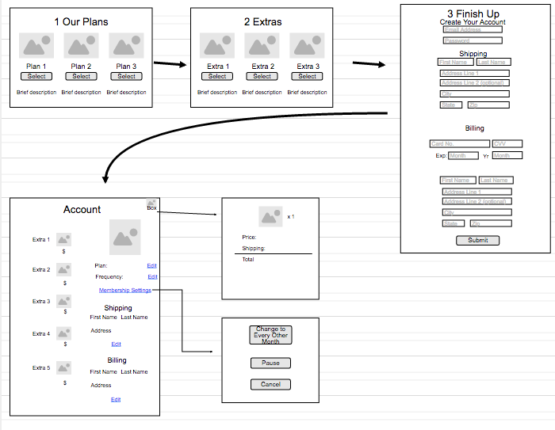

#Monthly Markers

##Ruby-based Subscription Service

Guests can log in to an existing account or sign up. They can choose one of three subscription plans and enter their personal information to get set up.  Once a Membership has been created, the user can view their account information on their "Account" page.  

From the Account page, a Member can edit any/all settings and add "extra" products.  The upcoming order can be viewed from the Box page.

###Wireframes:

##To Join

Visit https://afternoon-wave-81388.herokuapp.com/

##Development Process

Technologies used: Ruby on Rails, CSS, Bootstrap

Bcrypt gem utilized to establish authentication/authorization, which adds security for Members so that only they have access to their account. The data model relationship and actions through the members controller enables a customized Account page for each Member. The relationship model also allows Members to add extra products. The data model is as followed:

* Member has one order
* Order belongs to Member, has many order_products
* Order_products belongs to Order, has many products
* Product has many order_products

##Not-Yet-Implemented

* Billing capabilities
* pause/cancel feature
* Password reset link
* A "Congrats" page when a new Member signs up
* Order resets on the bill date
* Guests can add extras to their order on a step 2 of signup
* Shipping field split into multiple categories
* Add "quantity" field for Members to specify how extras they want

##User Stories

As a user, I go through a clear and simple signup process when starting my Membership

As a user, I have an account that is secure and can only be access with my login info

As a user, I can easily edit my account information

As a  user, I can add products and see what my next order contains

###Future Implementations

As a guest, I can add extras on step 2

As a new Member, I am alerted when my subscription has been created

As a Member, I can pause/cancel my account
